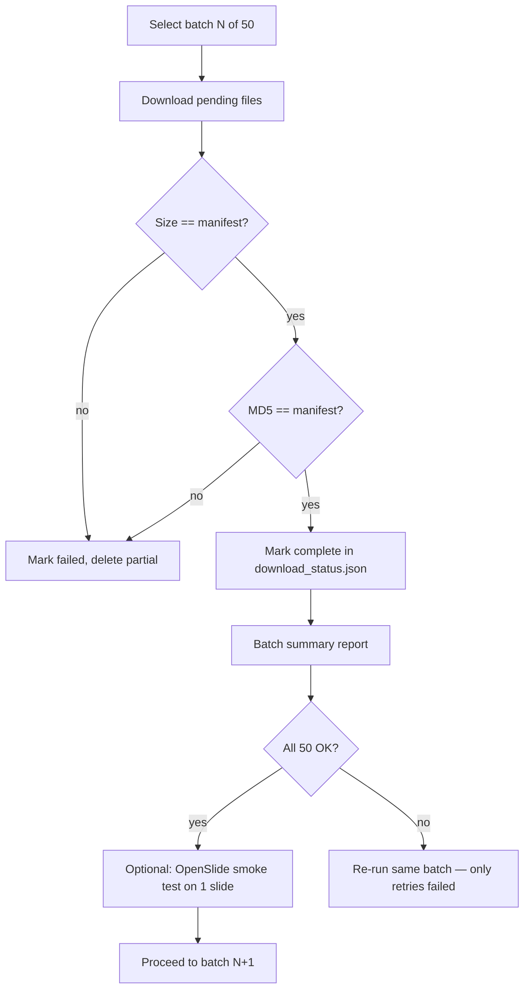

# Batched GDC Slide Download (50 at a time)

## Current state

- Manifest: [`Data/raw_data/histopathology/gdc_manifest.txt`](Data/raw_data/histopathology/gdc_manifest.txt) — **500 slides**, ~354 GB
- Downloader: [`EXP/download_gdc_slides.py`](EXP/download_gdc_slides.py) — already supports size check, optional MD5, skip-if-complete
- **1 slide** already downloaded and pipeline-tested successfully
- Existing flags: `--limit N` (first N only), `--no-verify-md5` (should **not** be used in production batches)

**Gap:** no way to download slides 51–100, 101–150, etc., and no persistent audit log to confirm each batch succeeded before continuing.

---

## Proposed batch workflow



---

## Code changes to [`EXP/download_gdc_slides.py`](EXP/download_gdc_slides.py)

### 1. Batch selection flags

Add CLI args:

| Flag | Purpose |
|---|---|
| `--batch-size 50` | Files per batch (default 50) |
| `--batch-index 0` | Which batch to run (0-based: batch 0 = rows 1–50, batch 1 = rows 51–100, …) |
| `--verify-only` | Skip download; re-check all files in the selected batch |

Slice logic on manifest rows (after header):
```python
start = batch_index * batch_size
end   = start + batch_size
rows  = all_rows[start:end]   # batch 0 → 50 files, batch 9 → last 50 of 500
```

Convenience: `--batch-index -1` or omitting batch-index with auto-detect → pick **first batch with any pending/failed files**.

### 2. Persistent status file

Write [`Data/raw_data/histopathology/download_status.json`](Data/raw_data/histopathology/download_status.json):

```json
{
  "6a0ea716-...": {
    "filename": "TCGA-86-8074-...svs",
    "batch_index": 0,
    "status": "complete",
    "expected_size": 532458405,
    "local_size": 532458405,
    "md5_ok": true,
    "updated_at": "2026-07-25T..."
  }
}
```

Statuses: `pending` | `downloading` | `complete` | `failed`

After each file, atomically update this file so interrupted runs can resume cleanly.

### 3. Safer re-download (fix partial-file risk)

Current script appends to existing partial files — GDC API may **not** support HTTP Range, which can corrupt files. Change to:

- If local size ≠ expected size → **delete partial file**, download fresh
- Only skip when size matches **and** MD5 passes

MD5 verification should be **on by default** for batch runs (remove temptation to use `--no-verify-md5` except for quick smoke tests).

### 4. Batch summary at end of each run

Print and append to [`Data/raw_data/histopathology/download.log`](Data/raw_data/histopathology/download.log):

```
Batch 0 (50 files): complete=48, failed=2, skipped=0
Failed IDs: [...]
Estimated batch size: 35.2 GB
Total progress: 48/500 (9.6%)
```

---

## New script: [`EXP/verify_downloads.py`](EXP/verify_downloads.py)

Standalone auditor (callable after any batch):

1. Read manifest + `download_status.json`
2. For each file in a batch (or all):
   - File exists on disk
   - `st_size == manifest size`
   - MD5 matches manifest hash
   - Optional: `openslide.OpenSlide(path)` opens without error (requires `source scripts/env.sh`)
3. Write report CSV: `Data/raw_data/histopathology/verification_report.csv`

Use this as the **gate** before starting the next batch.

---

## How to run (50 at a time)

```bash
cd /Users/soumoha2/Documents/BITS/ONCOLENS

# Batch 0 (slides 1–50)
uv run python EXP/download_gdc_slides.py --batch-size 50 --batch-index 0

# Verify batch 0 before continuing
uv run python EXP/verify_downloads.py --batch-size 50 --batch-index 0

# Batch 1 (slides 51–100) — only when batch 0 is 100% complete
uv run python EXP/download_gdc_slides.py --batch-size 50 --batch-index 1
uv run python EXP/verify_downloads.py --batch-size 50 --batch-index 1

# … repeat through batch-index 9 (last 50 of 500)
```

**Retry failed files in a batch** (no need to re-download successes):
```bash
uv run python EXP/download_gdc_slides.py --batch-size 50 --batch-index 0
# Script skips `complete` entries; only retries `failed` or missing
```

---

## Verification checklist (per batch)

Before moving to batch N+1, confirm:

| Check | How |
|---|---|
| Count | `complete == batch_size` in summary (or all non-failed) |
| Size | Every file `local_size == expected_size` |
| MD5 | Every file hash matches manifest (catches corruption) |
| OpenSlide | `verify_downloads.py --openslide-check` on 1–3 random slides |
| Disk space | `df -h .` — ~35–40 GB free per batch typical |
| Progress log | `download_status.json` has no `failed` for that batch |

Expected throughput: ~4 min/slide observed on smoke test → **~3–4 hours per batch of 50** (varies by slide size and network).

---

## Integration with Phase 4 pipeline

After **batch 0** completes and verifies, you can already:

1. Re-run `build_slide_manifest()` in [`EXP/histopathology_data_acquisition.ipynb`](EXP/histopathology_data_acquisition.ipynb)
2. Run embedding pipeline on downloaded slides while later batches continue downloading
3. No need to wait for all 500 before starting feature extraction — process per batch as slides arrive

Update plan Phase 4.1 download command to reference batched workflow instead of single monolithic run.

---

## Files to create/modify

| File | Action |
|---|---|
| [`EXP/download_gdc_slides.py`](EXP/download_gdc_slides.py) | Add batch flags, status JSON, safer partial handling, batch summary |
| `EXP/verify_downloads.py` | New — audit size/MD5/OpenSlide per batch |
| [`Data/raw_data/histopathology/download_status.json`](Data/raw_data/histopathology/download_status.json) | Created on first batch run (gitignored via existing raw_data ignore) |
| [`.cursor/plans/oncolens_histopathology_pipeline_edb34ade.plan.md`](.cursor/plans/oncolens_histopathology_pipeline_edb34ade.plan.md) | Update Phase 4.1 section with batched commands |
