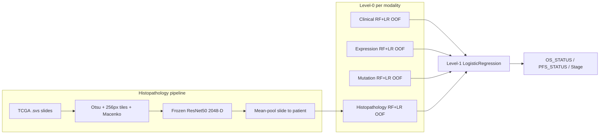
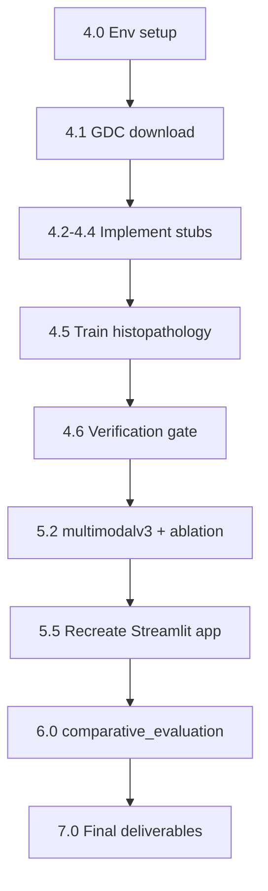

# ONCOLENS Histopathology & 4-Modality Fusion — Execution Plan

Based on [Master_Handoff_Plan.md](claude%20plans/Histopathology%20plans/Master_Handoff_Plan.md). Current repo state on this machine (`developer` @ `ee423c6`):

**Already done (committed):**
- Expression, Mutation, and 3-modality Multimodal models trained and in `Data/feature_store/`
- [`EXP/backfill_test_predictions.py`](EXP/backfill_test_predictions.py) + `test_predictions.csv` for Expression/Mutation (Phase 6 prerequisite)
- Histopathology scaffolds: [`EXP/histopathology_data_acquisition.ipynb`](EXP/histopathology_data_acquisition.ipynb), [`EXP/histopathology_v1.ipynb`](EXP/histopathology_v1.ipynb), [`EXP/requirements-histopathology.txt`](EXP/requirements-histopathology.txt)
- `.gitignore` entry for `/Data/raw_data/histopathology`

**Not yet started:**
- No raw `.svs` slides (`Data/raw_data/histopathology/` does not exist)
- Four pipeline stubs in `histopathology_v1.ipynb` still raise `NotImplementedError`
- No `multimodalv3.ipynb`, `comparative_evaluation.ipynb`, or `eval_utils.py`
- `app/` absent — will be **recreated from multimodalv2 at Phase 5** (per your choice)

**Environment on this machine:**
- ~813 GB free disk — sufficient for GDC download (100s of GB)
- `torch` not installed yet — will be installed via **uv** before Phase 4.2
- **Package manager: [uv](https://docs.astral.sh/uv/)** (replaces pip/venv for this project)

---

## Architecture (target end state)



**Locked design decisions (do not re-litigate):**
- Frozen ImageNet ResNet50, mean-pooling, no PCA unless overfitting forces it
- MPS/GPU for embedding extraction
- No standalone Clinical-only model; no live `.svs` upload in Streamlit
- 4-modality cohort = strict inner join (Expression ∩ Mutation ∩ Clinical ∩ Histopathology)

---

## Phase 4 — Histopathology Module

### 4.0 Environment setup with uv (first action)

**Why uv:** single lockfile, fast installs, one reproducible env across notebooks, histopathology pipeline, and Streamlit app.

**Single sklearn pin:** pin `scikit-learn==1.8.0` once in root `[project] dependencies` — shared by all groups. The handoff's split (latest sklearn for training vs 1.8.0 for app) was an artifact of keeping `app/requirements.txt` and `EXP/requirements-histopathology.txt` as separate files, not a technical requirement. Using one version everywhere ensures saved `.joblib` models deserialize and predict identically in notebooks and the Streamlit app. The handoff already documented minor AUC drift when backfill ran on sklearn 1.9.0 vs the 1.8.0 training pin — unifying avoids that.

**Step 1 — Install system tools (not managed by uv):**
```bash
brew install openslide          # required before openslide-python builds
# gdc-client: install from https://gdc.cancer.gov/access-data/gdc-data-transfer-tool
```

**Step 2 — Bootstrap uv project at repo root:**

Create [`pyproject.toml`](pyproject.toml) with one shared sklearn pin and two optional groups for heavy/extra deps only:

| Group | Purpose | Adds (on top of core) |
|---|---|---|
| *(default / core)* | All notebooks + model serving | `pandas`, `numpy`, `scikit-learn==1.8.0`, `joblib`, `matplotlib`, `jupyter`, `ipykernel` |
| `histopathology` | Phase 4 WSI pipeline | `torch`, `torchvision`, `openslide-python`, `Pillow`, `histolab`, `opencv-python` |
| `app` | Phase 5 Streamlit UI | `streamlit` |

Example structure:
```toml
[project]
name = "oncolens"
version = "0.1.0"
requires-python = ">=3.11"
dependencies = [
  "pandas", "numpy", "scikit-learn==1.8.0", "joblib",
  "matplotlib", "jupyter", "ipykernel",
]

[project.optional-dependencies]
histopathology = [
  "torch", "torchvision", "openslide-python",
  "Pillow", "histolab", "opencv-python",
]
app = ["streamlit"]
```

Then:
```bash
# Install uv if needed: curl -LsSf https://astral.sh/uv/install.sh | sh
uv python pin 3.11
uv sync --extra histopathology --extra app   # single env for everything
uv run python -c "import sklearn; print(sklearn.__version__)"   # → 1.8.0
uv run python -c "import torch; print('MPS:', torch.backends.mps.is_available())"
```

**Step 3 — Notebook kernel:**
```bash
uv run python -m ipykernel install --user --name oncolens --display-name "ONCOLENS (uv)"
```
Select **ONCOLENS (uv)** kernel in Jupyter for all `EXP/*.ipynb` notebooks.

**Step 4 — Running scripts/notebooks:**
```bash
uv run python EXP/backfill_test_predictions.py
uv run jupyter lab
uv run streamlit run app/oncolens_inference.py
```

**Migration note:** [`EXP/requirements-histopathology.txt`](EXP/requirements-histopathology.txt) stays as reference documentation but `pyproject.toml` + `uv.lock` become the source of truth. Commit both on setup. The handoff's separate `app/requirements.txt` is superseded — sklearn is pinned once at the project root.

### 4.1 Data acquisition

1. Fetch manifest (already done, or re-run):
   ```bash
   uv run python EXP/fetch_gdc_manifest.py
   ```
   Produces `Data/raw_data/histopathology/gdc_manifest.txt` — **500 diagnostic slides**, ~354 GB.

2. **Download in batches of 50** (with size + MD5 verification):
   ```bash
   # Batch 0 (slides 1–50)
   uv run python EXP/download_gdc_slides.py --batch-size 50 --batch-index 0

   # Verify before next batch
   uv run python EXP/verify_downloads.py --batch-size 50 --batch-index 0 --openslide-check

   # Batch 1 (slides 51–100) — only after batch 0 is 100% verified
   uv run python EXP/download_gdc_slides.py --batch-size 50 --batch-index 1
   uv run python EXP/verify_downloads.py --batch-size 50 --batch-index 1 --openslide-check

   # … repeat through batch-index 9 (last 50 of 500)
   ```

   **Auto-resume:** re-run the same batch command to retry only failed/missing files; completed files are skipped.

   **Auto-detect next batch:** `uv run python EXP/download_gdc_slides.py --batch-size 50 --batch-index -1`

   Progress tracked in `Data/raw_data/histopathology/download_status.json` and `download.log`.

3. **Per-batch verification checklist** (before batch N+1):
   - `verify_downloads.py` reports `Passed: 50, Failed: 0` (exit code 0)
   - Every file: `local_size == expected_size` and MD5 matches manifest
   - Optional OpenSlide check passes on sample slides
   - Sufficient disk space (~35–40 GB free per batch)

4. Run [`EXP/histopathology_data_acquisition.ipynb`](EXP/histopathology_data_acquisition.ipynb):
   - `build_slide_manifest()` → `slide_manifest.csv`
   - `report_patient_overlap()` → **record 4-way intersection count** (gates Phase 5 cohort size)

   Note: you can start embedding/training on completed batches while later batches download.

### 4.2–4.4 Implement stubs in [`EXP/histopathology_v1.ipynb`](EXP/histopathology_v1.ipynb)

| Function | Implementation |
|---|---|
| `tile_slide()` | OpenSlide + histolab: Otsu tissue mask on thumbnail, 256×256 @ 20×, discard >85% background tiles, Macenko stain normalization |
| `build_resnet50_encoder()` | `torchvision.models.resnet50(weights=ResNet50_Weights.IMAGENET1K_V2)`, strip FC, `.eval()`, MPS device |
| `embed_tiles()` | Batch inference, cache per-slide `.npy` to `Data/feature_store/histopathology/tile_embeddings_cache/` |
| `aggregate_patient_features()` | Mean-pool tiles → slide; mean across slides → 2048-D patient vector (`embed_0`..`embed_2047`) |

Already implemented (no changes needed): `train_and_eval()`, `save_target_to_feature_store()`, clinical merge, 80/20 stratified split (`random_state=42`, stratify=`OS_STATUS`).

### 4.5 Train and save

Run full notebook for `OS_STATUS`, `PFS_STATUS`, `Stage`. Outputs per target:

```
Data/feature_store/histopathology/{target}/
  features.csv, metadata.json, model.joblib, test_predictions.csv
Data/feature_store/registry_histopathology.json
```

Follow same Level-0 paradigm as [`EXP/gene_expression_v2.ipynb`](EXP/gene_expression_v2.ipynb) (RF `n_estimators=300`, LR `C=0.1` — match Expression hyperparams for the new dense embedding modality).

### 4.6 Verification gate (must pass before Phase 5)

- Visual QC: tissue mask + tile grid overlays on 5–10 slides
- Tile-count report per slide (flag near-zero counts)
- Stain-normalization spot check across TCGA sites (e.g. `TCGA-55-*` vs `TCGA-86-*`)
- Standalone Histopathology AUC clearly above random for at least one target
- Document 4-way cohort size; if below ~250–300, note as limitation in report

---

## Phase 5 — 4-Modality Multimodal Fusion

### 5.1 Cohort

Retrain on **new 4-way intersection** only. No mixed-availability fallback.

### 5.2 New notebook: `EXP/multimodalv3.ipynb`

Fork [`EXP/multimodalv2.ipynb`](EXP/multimodalv2.ipynb):

- Load Clinical + Expression + Mutation + Histopathology; print cohort size prominently
- Extend `MODALITIES` list to 4; Level-0 RF+LR OOF loop already generalizes
- Level-1 meta-features: 4 modalities × class probabilities (Stage: 4×n_classes)
- Save to `Data/feature_store/multimodal_model_v4/` (or overwrite with versioned registry — keep 3-modality artifacts intact for Phase 6 ablation)
- Update `registry_multimodal.json` with both 3-modality (same cohort) and 4-modality entries

### 5.3 Critical ablation

On the **identical 4-way cohort**, retrain:
1. 3-modality stack (Clinical + Expression + Mutation)
2. 4-modality stack (+ Histopathology)

Compare AUC deltas — ensures improvement is from Histopathology, not cohort shrinkage.

### 5.4 Feature contribution table

Save to `Data/feature_store/comparative_evaluation/modality_improvement_table.csv`:
- Per target: Accuracy, Precision, Recall, F1, ROC-AUC for both stacks + Δ AUC (abs/%)
- Grouped bar chart for final report

### 5.5 Recreate Streamlit app

Since `app/` is absent, recreate from multimodalv2 patterns:
- New `app/oncolens_inference.py` with functions: `load_processed_tables()`, `_align_modality()`, `_build_meta_features()`, `make_uploaded_patient()`, `predict_multimodal()`
- Add Histopathology branch in `_align_modality()` (`fillna(0.0)` for missing embed columns)
- 4th optional input: precomputed histopathology feature vector (no `.svs` processing)
- Load 4-modality `multimodal_stack.joblib` bundle

---

## Phase 6 — Comparative Evaluation

Create:
- [`EXP/eval_utils.py`](EXP/eval_utils.py) — uniform metric computation from `test_predictions.csv`
- [`EXP/comparative_evaluation.ipynb`](EXP/comparative_evaluation.ipynb)

**5 models × 3 targets × 5 metrics:**

| Model | Predictions source |
|---|---|
| Gene Expression | `Data/feature_store/expression/{target}/test_predictions.csv` |
| Mutation | `Data/feature_store/mutation/{target}/test_predictions.csv` |
| Histopathology | `Data/feature_store/histopathology/{target}/test_predictions.csv` |
| 3-Modality | 3-mod retrain on 4-way cohort |
| 4-Modality | `multimodal_model/{target}/test_predictions.csv` |

Load registries: `registry.json`, `registry_mutation.json`, `registry_histopathology.json`, `registry_multimodal.json`.

Output: `Data/feature_store/comparative_evaluation/comparison_table.csv` + grouped bar charts.

**Sanity checks:**
- Recomputed ROC-AUC ≈ registry AUC (± sklearn version drift, as documented in handoff §2.1)
- Fixed macro/weighted averaging for multiclass Stage across all 5 rows
- 4-mod ≥ 3-mod (same cohort) ≥ each single-modality per target

---

## Phase 7 — Final Deliverables

- Final project report (performance, cohort analysis, ablation results)
- Architecture diagrams (extend mermaid above)
- Comparative evaluation results + modality improvement table
- Presentation deck
- Source code documentation (notebook headers + `eval_utils.py` docstrings)
- Git cleanup: commit Phase 4–6 artifacts (excluding raw slides and tile cache)

---

## Recommended execution order



**Estimated effort:** Phase 4.1 download is I/O-bound (hours); embedding extraction is GPU-bound (hours–days depending on slide count); Phases 5–6 are comparatively fast (notebook runs on tabular data).

**Risk notes:**
- All new training (Histopathology, multimodalv3) runs on the same pinned sklearn 1.8.0 — consistent with originally saved `.joblib` artifacts
- Existing backfilled `test_predictions.csv` were generated on sklearn 1.9.0; optionally re-run `uv run python EXP/backfill_test_predictions.py` after env setup to align metrics with the pin
- 4-way cohort may shrink vs current 450 patients — ablation design handles this
- Tile cache can grow large — keep under `Data/feature_store/histopathology/tile_embeddings_cache/` (gitignored via raw_data pattern or add explicit ignore)
